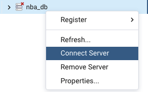

# Lab 2 - Load data from the dockerized MySQL into RDS 

The objective of this lab is for you to also get experience with extracting data from a SQL database. 
We are going to use the dockerized MySQL db with NBA data created in the previous lab and we are 
going to extract the data and load it into a database hosted in AWS. 

The following diagram can give you a visual overview of how are we going to connect our services together. 


**Pre-requisites:** 
* Lab 1 completed 
* AWS Enroute Account
* Clone this repository
* Install the [AWS Command Line Interface](https://docs.aws.amazon.com/cli/latest/userguide/getting-started-install.html)
* Install [psql](https://www.postgresql.org/download/)

## 1. Throwback 
You will need to run the dockerized MySQL database and load the NBA as per the lab 1 requested. 
```
$ docker-compose up -d
```

## 2. AWS

### 2.1 AWS configure
For CLI access, you need an access key ID and secret access key, this will be provided upon account creation. 

You have two options, if you have never setup AWS credentials you can choose option 1, if you already have profiles defined
please follow option 2 and name your new profile different than `default`: 

**Option 1:  AWS CLI**
1. Verify AWS CLI is installed 
    ```shell script
    $ aws --version
    aws-cli/2.7.12 Python/3.9.11 Darwin/20.6.0 exe/x86_64 prompt/off
    ```

2. Run `aws configure` and provide the values provided to you:
    ````shell script
    $ aws configure
    AWS Access Key ID [*************xxxx]: <Your AWS Access Key ID>
    AWS Secret Access Key [**************xxxx]: <Your AWS Secret Access Key>
    Default region name: [us-east-2]: us-west-2
    Default output format [None]:
    ````

This will generate a credentials file under `~/.aws/credentials`, you can have multiple profiles for different accounts.

**Option 2:  Manually create credentials files**
1. Create an `.aws` directory under your home directory and change to that folder
    ```
    $ mkdir ~/.aws/
    $ cd ~/.aws/
    ```
2. Use a text editor to create a text file (without extension) named `credentials` and put the following in that file: 
    ```
    [default]
    aws_access_key_id = <Your access key>
    aws_secret_access_key = <Your secret key>
    ```
3. Use a text editor to create a text file (without extension) named `config` and put the following in that file: 
    ```
    [default]
    region = us-west-2
    ```
  
### 2.2 AWS RDS 
AWS RDS (Relational Database Service) is a managed SQL database service, it supports multiple database engines to store and
organize data, it also helps with relational database management tasks, such as data migration, backup, recovery and patching.

The RDS instance that we are going to use in this lab is already up and running, so you will only need to log into the db, 
create a database, create the tables and start loading your data. 


The RDS instance is using IAM database authentication, which is more secure than native authentication methods because of the following:
* IAM generates db authentication tokens using your AWS access keys (you don't need to store database user creds)
* Auth tokens have a lifespan of 14 minutes
* IAM db auth requires an SSL connection, therefore everything that you transmit to and from your RDS DB instance is encrypted 


Follow the steps: 
1. Generate an AWS authentication token to identify the IAM role by running `generate-db-auth-token` with the aws username you were assigned.
    ```shell script
    export RDSHOST="<the_rds_host_here>"
    export PGPASSWORD="$(aws rds generate-db-auth-token --hostname $RDSHOST --port 5432 --region us-west-2 --username iamuser)"
    ```
2. This will create a **temporary** password
    ```shell script
    echo $PGPASSWORD
    ```
   
   > NOTE: Each token expires 15 minutes after you generate it. If you try to re-establish the connection with the same token
   > your connection will fail. You will need to generate a new token. 

3. Connect to the AWS RDS DB instance using IAM role credentials and the signed IAM authentication token through a client (pgAdmin) or through the cli: 

**Option 1: Through pgAdmin** 
Launch the pgAdmin application and add a new server:
 
1. In **General** tab, enter a name to identify the server, and deselect **Connect now?**:


2. In **Connection** tab, enter the aws db host, the assigned port and the username (corresponding to your IAM user):


3. Under **SSL** tab, change to **Require** and click **Save**:


4. Go to the server in the left panel, right click and click **Connect Server** :


5. Enter the temporary password generated by the `generate-db-auth-token` command and click `OK`: 


**Option 2: Through cli** 
We are going to connect to a default database called `postgres`:
```
$ psql "host=$RDSHOST port=5432 sslmode=require   user=dpatron dbname=postgres password=$PGPASSWORD"
```

### 2.3 Creating the objects

Now that you are connected, you have to create a database to hold your tables, please create a database with the following 
pattern: `<iamuser>_nba_data`

### ✏️  Exercise 1: Create the DDL's 
Generate the DDL's to create the tables under your database in a file called `postgres_ddls.sql, you can leverage the one you already have, just make sure
that the syntax for MySQL and PostgreSQL are compatible. 

## 3. Python
From the last lab we know how to read data from an API and load it into a SQL database, now we are going to read from a SQL database
and insert into another SQL db. 

### 3.1 The requirements.txt
We are going to use: 
* json - to transform text into json
* configparser - for configuration management
* pandas - to load our json into a DataFrame 
* sqlalchemy - to make the connection between Python and the dockerized MySQL and PosgreSQL
* boto3: to connect to AWS RDS 

Create a new virtual environment, activate it and install the requirements: 
```shell script
python3 -m venv /path/to/new/virtual/environment
source /newvirtualenvironment/bin/activate
pip install -r requirements.txt
```

### 3.2 The [ConfigParser](https://docs.python.org/3/library/configparser.html)
We are going to define all of our important variables inside a file called `config.ini`, this file
should never be committed since it holds important data such as passwords or secrets and is intended to live directly
on the server or in an external secrets manager service. 

### ✏️ Exercise 2: Create your own `config.ini` file to store your secrets and update the `config.py` accordingly
In the previous lab we created a `config.ini` file where we stored our secrets, in this lab you will have yo create a new file
and add the secrets for both databases, then you will have to update the `config.py` file to pull your secrets from there 
into your python script. 

### 3.3 Reading from dockerized MySQL
In the lab 1 we connected to our dockerized MySQL db, we are going to re-use the connection we have previously created, 
```python 
engine = create_engine(f"mysql://{db_username}:{db_pwd}@{db_host}:{db_port}/{db_name}")
con = engine.connect()
```
### 3.4 Pandas [read_sql()](https://pandas.pydata.org/pandas-docs/stable/reference/api/pandas.read_sql.html)
The `read_sql()` method will allow us to read from our tables in the MySQL database and load it into a pandas DataFrame.
The parameters that we need: 
* `sql` :  SQL query to be executed
* `con`: The connection to mysql that we previously created

```python
df = pd.read_sql(sql="SELECT * FROM teams", con=conn)
print(df)
```
Example: 
````
    id abbreviation           city conference   division               full_name           name
0    1          ATL        Atlanta       East  Southeast           Atlanta Hawks          Hawks
1    2          BOS         Boston       East   Atlantic          Boston Celtics        Celtics
2    3          BKN       Brooklyn       East   Atlantic           Brooklyn Nets           Nets
3    4          CHA      Charlotte       East  Southeast       Charlotte Hornets        Hornets
4    5          CHI        Chicago       East    Central           Chicago Bulls          Bulls
5    6          CLE      Cleveland       East    Central     Cleveland Cavaliers      Cavaliers
6    7          DAL         Dallas       West  Southwest        Dallas Mavericks      Mavericks
7    8          DEN         Denver       West  Northwest          Denver Nuggets        Nuggets
````

### 3.5 IAM authentication
Now that we are reading data from the dockerized MySQL, we have to handle the connection for the PosgreSQL db, and
for that, just like we did through the console, we need to generate a signed IAM authentication token, and for
that we are going to leverage the credentials stored under  `aws/credentials`, make sure you select the 
correct profile if you have multiple profiles set.

```python
session = boto3.Session(profile_name='default')
```

Then, we are going to execure the `generate-auth-token` but with the boto3 Python SDK:
 ```python
client = session.client('rds')
token = client.generate_db_auth_token(DBHostname=pg_db_host, Port=pg_db_port, DBUsername=pg_db_user, Region=pg_db_region)
```

Now that we have our temporary password, we can now create a new connection string to connect to our Postgres database:  
````python
pg_engine = create_engine(f"postgresql+psycopg2://{pg_db_user}:{token}@{pg_db_host}:{pg_db_port}/{pg_db_name}")

````    

### ✏️  Final Exercise: Load the NBA data into PostgreSQL db
Load all the tables created in the lab 1 into the PostgreSQL db through the python script: 
* Teams
* Games
* Players 

Commit all your exercises and upload them to .... AWS CodeCommit? 

Don't forget to check the evaluation rubric to make sure you are not missing anything and to stop your container
when you are done with the lab.

```
$ docker-compose down 
```